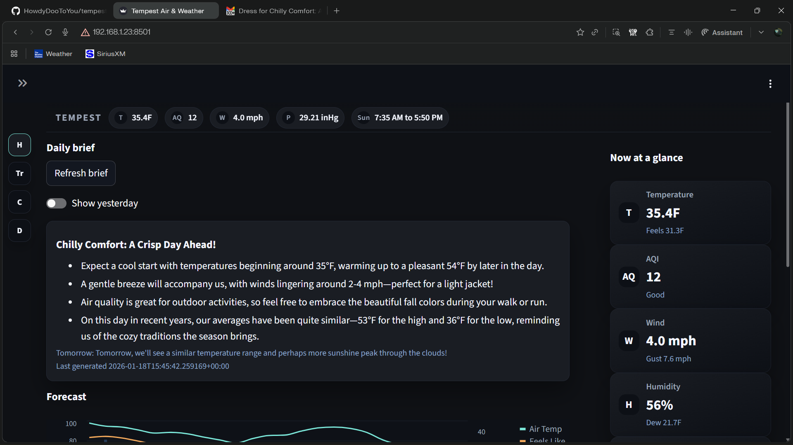

# Tempest Weather and Air Quality Dashboard

Streamlit dashboard for Tempest weather and AirLink air-quality data with live gauges, palettes, forecasts, and background services.

## Features
- Home, Trends, Compare, and Data pages for weather and AQI.
- Live gauges with highlights and local time, plus a sticky at-a-glance strip.
- Theme palettes plus a Custom token picker (with light/dark modes).
- Connection and ingest health panel with collector status.
- Forecast via Open-Meteo fallback with optional Tempest better_forecast.
- Daily Brief (OpenAI) and Daily Email summary (NSSM services).
- NWS alerts and outlooks (HWO) displayed in UI and optionally delivered via email/SMS.
- Freeze alerts via email/SMS (UI or background worker).



## Supported devices
- Tempest Station (weather observations)
- Tempest Hub (connectivity/heartbeat)
- AirLink (PM/AQI; treated as outdoor)

## Requirements
- Python 3.10+ (tested on 3.12)
- Dependencies: `streamlit`, `streamlit-autorefresh`, `pandas`, `altair`, `requests`
- Optional: `meteostat` for "On this day" historical context in Daily Briefs.
- Tempest/AirLink data available in `data/tempest.db` (and related tables)
- Optional env: `CONTROL_REFRESH_SECONDS` (default 120; uses `AUTO_REFRESH_SECONDS` as fallback) to set the sidebar auto-refresh cadence without rerendering the main dashboard content.
- Optional env: `FORECAST_REFRESH_MINUTES` (default 30) to set how often Tempest better_forecast data is refreshed.
- Forecast credentials: set `TEMPEST_API_TOKEN` (preferred) or `TEMPEST_API_KEY` to enable the forecast tab/section.
- Forecast units: `FORECAST_UNITS=imperial` (default) or `metric` to request Tempest better_forecast in your preferred units.
- Daily Brief: optional OpenAI-powered digest written to SQLite via `src/daily_brief_worker.py`; set `OPENAI_API_KEY` (and optionally `DAILY_BRIEF_INTERVAL_MINUTES`, `DAILY_BRIEF_MODEL`). Uses Meteostat when available and falls back to Open-Meteo archive for "On this day" context when location is set. Installed as `TempestWeatherDailyBrief` NSSM service alongside UI/Alerts.
- Daily Email: optional 7am summary email via `src/daily_email_worker.py`; set `DAILY_EMAIL_TO` (and optionally `DAILY_EMAIL_HOUR`, `DAILY_EMAIL_MINUTE`, `DAILY_EMAIL_LAT`, `DAILY_EMAIL_LON`). Installed as `TempestWeatherDailyEmail` NSSM service.

## Quick start
1) Create a virtual environment:
   ```bash
   python -m venv .venv
   .\.venv\Scripts\activate
   ```
2) Install deps:
   ```bash
   pip install streamlit streamlit-autorefresh pandas altair requests
   ```
3) Run the app:
   ```bash
   streamlit run dashboard.py
   ```
4) Optional: create `.env` from `.env.example` and run the convenience script:
   ```powershell
   copy .env.example .env
   .\scripts\run_streamlit.ps1
   ```
   The script loads `.env` into the current shell and does not overwrite existing env vars unless `-OverrideEnv` is used.
   For services, skip `.env` and set environment variables via NSSM or System Environment.

## Configuration
- `TEMPEST_API_TOKEN`: optional, for auto-location.
- `TEMPEST_DB_PATH`: optional, defaults to `data/tempest.db`.
- `LOCAL_TZ`: optional, defaults to `America/New_York`.

### Alerts
- SMTP credentials (env or Windows Credential Manager):
  - Env vars: `SMTP_USERNAME`, `SMTP_PASSWORD`, `ALERT_EMAIL_FROM`
  - Credential Manager: store a Generic credential target `TempestWeatherSMTP` (override with `SMTP_CRED_TARGET`), username = Gmail address, password = app password.
  - Optional: `SMTP_HOST`, `SMTP_PORT`, `SMTP_USE_TLS`, `SMTP_USE_SSL`
  - Helper script:
    ```powershell
    .\scripts\set_smtp_credential.ps1 -Username "you@gmail.com"
    ```
    Use `-Target` to match `SMTP_CRED_TARGET` if you changed it.
- Recipients:
  - Email: `ALERT_EMAIL_TO` (env) or save via Controls -> Alerts.
  - SMS: `VERIZON_SMS_TO` (env) or save via Controls -> Alerts.
- Thresholds:
  - `FREEZE_WARNING_F` (default 32)
  - `DEEP_FREEZE_F` (default 18)
  - `FREEZE_RESET_F` (default 34)
- Worker settings:
  - `ALERTS_WORKER_ENABLED=1` to stop UI sends when the worker is active.
  - `ALERT_WORKER_INTERVAL_SECONDS` (default 60)
  - Use the worker for continuous alerts when no UI session is open.

## Alerts and privacy
- SMTP credentials are never stored in the database or code.
- Windows Credential Manager credentials are loaded at runtime and do not need to be in `.env` or service config.
- Recipient overrides saved in the UI are stored in `data/tempest.db` (gitignored).
- Saved recipients override env values; clear them in Controls -> Alerts to revert.

## Run as a Windows service (NSSM)
1) Install NSSM (for example: `choco install nssm`).
2) Configure environment variables for services (Windows System Environment or NSSM Environment tab).
   The installer reads from the current shell and writes them into `AppEnvironmentExtra`.
   If using Windows Credential Manager, set `SMTP_CRED_TARGET` (optional; defaults to `TempestWeatherSMTP`).
   Credential Manager lookups use the service account, so run NSSM services under your user if needed.
3) Run:
   ```powershell
   .\scripts\install_services.ps1
   ```
4) Remove services:
   ```powershell
   .\scripts\uninstall_services.ps1
   ```
5) Convenience commands (run as Administrator for start/stop/restart/install):
   ```powershell
   .\scripts\services.ps1 status
   .\scripts\services.ps1 start
   .\scripts\services.ps1 restart -Target alerts
   .\scripts\services.ps1 logs -Target ui -LogLines 200
   .\scripts\services.ps1 env
   ```
   Or use the interactive menu:
   ```powershell
   .\scripts\services_menu.ps1
   ```

Services installed by the script:
- `TempestWeatherUI` (Streamlit dashboard on port 8501)
- `TempestWeatherAlerts` (background alerts worker)
- `TempestWeatherDailyBrief` (OpenAI daily brief generator)
- `TempestWeatherDailyEmail` (7am email summary)
The install script sets `ALERTS_WORKER_ENABLED=1` for the UI service to avoid duplicate alerts.

Service env checklist (NSSM/System):
- Required: `SMTP_USERNAME`, `SMTP_PASSWORD`, `ALERT_EMAIL_FROM` (or use `SMTP_CRED_TARGET` and omit username/password)
- Recipients: `ALERT_EMAIL_TO` and `VERIZON_SMS_TO` (optional if saved via Controls -> Alerts)
- Transport: `SMTP_HOST`, `SMTP_PORT`, `SMTP_USE_TLS`, `SMTP_USE_SSL` (set one true)
- Alerts: `FREEZE_WARNING_F`, `DEEP_FREEZE_F`, `FREEZE_RESET_F` (optional)
- Optional: `LOCAL_TZ`, `TEMPEST_DB_PATH`, `TEMPEST_API_TOKEN`
- Alerts worker: `ALERT_WORKER_INTERVAL_SECONDS` (service only)
- UI service: `ALERTS_WORKER_ENABLED=1` (set by installer)
- Daily brief: `DAILY_BRIEF_LAT`, `DAILY_BRIEF_LON` (optional location for Meteostat history)
- Daily email: `DAILY_EMAIL_TO`, `DAILY_EMAIL_HOUR`, `DAILY_EMAIL_MINUTE`, `DAILY_EMAIL_LAT`, `DAILY_EMAIL_LON`
- NWS alerts: `NWS_USER_AGENT` (required by api.weather.gov), `NWS_ALERTS_ENABLED`, `NWS_HWO_NOTIFY`, `NWS_ZONE` (optional override like `GAZ041`)

## Usage notes
- Home combines forecast, daily brief, at-a-glance cards, and outlook.
- Trends lets you reorder or hide charts with the chart order multiselect.
- Compare offers time-to-time overlays (today vs yesterday, this week vs last week, same day last year).
- Data provides raw tables and diagnostics for inspection.

## Development
- Run `python -m py_compile dashboard.py src/alerting.py src/alerts_worker.py` for a quick syntax check.
- No external build needed; app is Streamlit-only.
