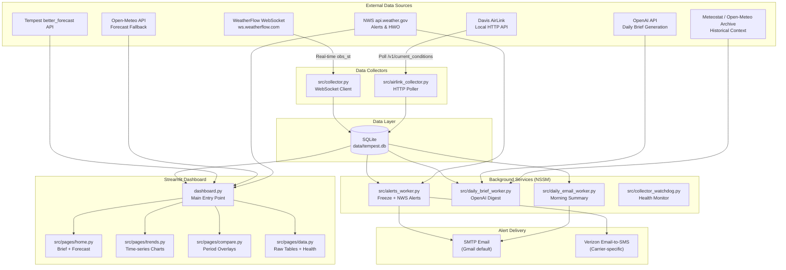

# Tempest Weather Architecture

This document provides a comprehensive overview of the Tempest Weather system architecture, data flow, and component interactions.

## System Overview

Tempest Weather is a personal weather station dashboard that aggregates real-time data from WeatherFlow Tempest devices and Davis AirLink air quality sensors. The system provides:

- Real-time weather monitoring with live gauges
- Air quality tracking (PM2.5/PM10/AQI)
- AI-powered daily weather briefs
- Multi-channel alerting (email, SMS)
- Historical comparisons and trend analysis

## Architecture Diagram



## Component Details

### Data Collectors

| Component | File | Protocol | Purpose |
|-----------|------|----------|---------|
| Tempest Collector | `src/collector.py` | WebSocket | Real-time weather observations from Tempest station |
| AirLink Collector | `src/airlink_collector.py` | HTTP | Air quality data from Davis AirLink sensor |
| Collector Watchdog | `src/collector_watchdog.py` | N/A | Health monitoring for collectors |

### Background Workers

| Service Name | File | Schedule | Purpose |
|--------------|------|----------|---------|
| TempestWeatherUI | `dashboard.py` | Always running | Streamlit dashboard on port 8501 |
| TempestWeatherAlerts | `src/alerts_worker.py` | Every 60s | Freeze warnings, NWS alerts |
| TempestWeatherDailyBrief | `src/daily_brief_worker.py` | Every 3 hours | AI-generated weather digest |
| TempestWeatherDailyEmail | `src/daily_email_worker.py` | Daily at 7am | Morning email summary |

### Dashboard Pages

| Page | File | Features |
|------|------|----------|
| Home | `src/pages/home.py` | Daily brief, forecast chart, 7-day outlook, NWS alerts |
| Trends | `src/pages/trends.py` | Reorderable time-series charts, metric selection |
| Compare | `src/pages/compare.py` | Today vs yesterday, week vs week, year vs year |
| Data | `src/pages/data.py` | Raw tables, health status, logs |

## Database Schema

The system uses SQLite with WAL (Write-Ahead Logging) mode for concurrent access. The database is located at `data/tempest.db` by default.

### Core Tables

```sql
-- Raw WebSocket messages (lossless archive)
raw_events (
    id INTEGER PRIMARY KEY,
    received_at_epoch INTEGER NOT NULL,
    device_id INTEGER,
    message_type TEXT,
    payload_json TEXT NOT NULL,
    payload_text TEXT,
    payload_hash TEXT
)

-- Parsed Tempest observations
obs_st (
    obs_epoch INTEGER NOT NULL,
    device_id INTEGER NOT NULL,
    wind_lull REAL,
    wind_avg REAL,
    wind_gust REAL,
    wind_dir INTEGER,
    station_pressure REAL,
    air_temperature REAL,
    relative_humidity INTEGER,
    illuminance REAL,
    uv REAL,
    solar_radiation REAL,
    rain_accumulated REAL,
    precip_type INTEGER,
    lightning_avg_dist REAL,
    lightning_strike_count INTEGER,
    battery REAL,
    report_interval INTEGER,
    PRIMARY KEY (obs_epoch, device_id)
)

-- Parsed AirLink observations
airlink_current_obs (
    did INTEGER,
    ts INTEGER,
    pm_1 REAL,
    pm_2p5 REAL,
    pm_10 REAL,
    aqi_pm25 INTEGER,
    ...
)

-- Collector health tracking
collector_heartbeat (
    name TEXT PRIMARY KEY,
    last_ok_epoch INTEGER,
    last_error_epoch INTEGER,
    last_ok_message TEXT,
    last_error TEXT
)
```

### Application State Tables

```sql
-- AI-generated daily briefs
daily_briefs (
    date TEXT PRIMARY KEY,
    generated_at TEXT,
    tz TEXT,
    headline TEXT,
    bullets_json TEXT,
    tomorrow_text TEXT,
    model TEXT,
    version TEXT
)

-- Alert state machine
alert_state (
    key TEXT PRIMARY KEY,
    value TEXT
)

-- User alert preferences
alert_config (
    key TEXT PRIMARY KEY,
    value TEXT
)

-- NWS alert deduplication
nws_alert_log (
    alert_id TEXT PRIMARY KEY,
    sent_at INTEGER NOT NULL
)

-- NWS HWO deduplication
nws_hwo_log (
    product_id TEXT PRIMARY KEY,
    sent_at INTEGER NOT NULL
)

-- Daily email tracking
daily_email_log (
    date TEXT PRIMARY KEY,
    sent_at TEXT,
    status TEXT,
    error TEXT
)

-- Application configuration
app_config (
    key TEXT PRIMARY KEY,
    value TEXT NOT NULL
)
```

## Data Flow

### 1. Weather Data Ingestion

```
WeatherFlow Cloud → WebSocket → collector.py → raw_events + obs_st → SQLite
```

1. `collector.py` connects to `wss://ws.weatherflow.com/swd/data`
2. Subscribes to device IDs for Tempest station and hub
3. Receives `obs_st` (observations) and heartbeat messages
4. Stores raw JSON losslessly in `raw_events` with SHA-256 hash
5. Parses `obs_st` messages into structured `obs_st` table

### 2. Air Quality Ingestion

```
AirLink Device → HTTP Poll → airlink_collector.py → airlink_current_obs → SQLite
```

1. `airlink_collector.py` polls `http://{DAVIS_AIRLINK_HOST}/v1/current_conditions`
2. Polls every 15 seconds (configurable via `AIRLINK_POLL_SEC`)
3. Parses PM1, PM2.5, PM10, and AQI values
4. Stores in `airlink_current_obs` table

### 3. Dashboard Rendering

```
SQLite → dashboard.py → Streamlit → Browser
```

1. `dashboard.py` loads data from SQLite
2. Fetches forecast from Tempest API (or Open-Meteo fallback)
3. Fetches NWS alerts and HWO
4. Renders pages via `src/pages/*.py`
5. Auto-refreshes every 120 seconds (configurable)

### 4. Alert Processing

```
SQLite → alerts_worker.py → SMTP/SMS → User
```

1. `alerts_worker.py` runs every 60 seconds
2. Checks latest temperature for freeze conditions
3. Fetches NWS active alerts and HWO
4. Deduplicates against `nws_alert_log` and `nws_hwo_log`
5. Sends via SMTP email and/or Verizon SMS gateway

### 5. Daily Brief Generation

```
SQLite + APIs → daily_brief_worker.py → OpenAI → daily_briefs → SQLite
```

1. `daily_brief_worker.py` runs every 3 hours
2. Aggregates last 24h of weather data
3. Fetches historical context (Meteostat → Open-Meteo Archive → local DB)
4. Fetches NWS alerts and HWO summaries
5. Sends prompt to OpenAI with structured JSON schema
6. Stores result in `daily_briefs` table

## External API Dependencies

| API | Purpose | Authentication |
|-----|---------|----------------|
| WeatherFlow WebSocket | Real-time observations | `TEMPEST_API_TOKEN` |
| WeatherFlow REST | Station metadata, better_forecast | `TEMPEST_API_TOKEN` |
| NWS api.weather.gov | Active alerts, HWO | `NWS_USER_AGENT` (required) |
| Open-Meteo Forecast | Forecast fallback | None (free tier) |
| Open-Meteo Archive | Historical data | None (free tier) |
| Meteostat | Historical context | None (optional library) |
| OpenAI | Daily brief generation | `OPENAI_API_KEY` |

## Technology Stack

| Layer | Technology | Version |
|-------|------------|---------|
| Frontend | Streamlit | Latest |
| Visualization | Altair | Latest |
| Data Processing | Pandas | Latest |
| Database | SQLite | 3.x (WAL mode) |
| WebSocket | websocket-client | Latest |
| HTTP | requests | Latest |
| AI | OpenAI Python SDK | Latest |
| Service Management | NSSM | 2.24+ |
| Platform | Windows | 10/11 |

## Security Considerations

1. **API Tokens**: Stored in environment variables, never in code or database
2. **SMTP Credentials**: Support Windows Credential Manager for secure storage
3. **Database**: Local SQLite file, gitignored by default
4. **Alert Recipients**: Can be stored in database (UI override) or environment
5. **Personal Data**: No PII collected beyond email/phone for alerts

## Scalability Notes

This system is designed for **single-user, single-station** deployments:

- SQLite is sufficient for one weather station's data volume
- Background workers run as Windows services on the same machine
- No horizontal scaling or multi-tenancy support
- Typical data volume: ~1MB/day for raw events

For multi-station or multi-user deployments, consider:
- PostgreSQL or TimescaleDB for the database
- Message queue (Redis, RabbitMQ) for collector coordination
- Container orchestration (Docker, Kubernetes) for workers
